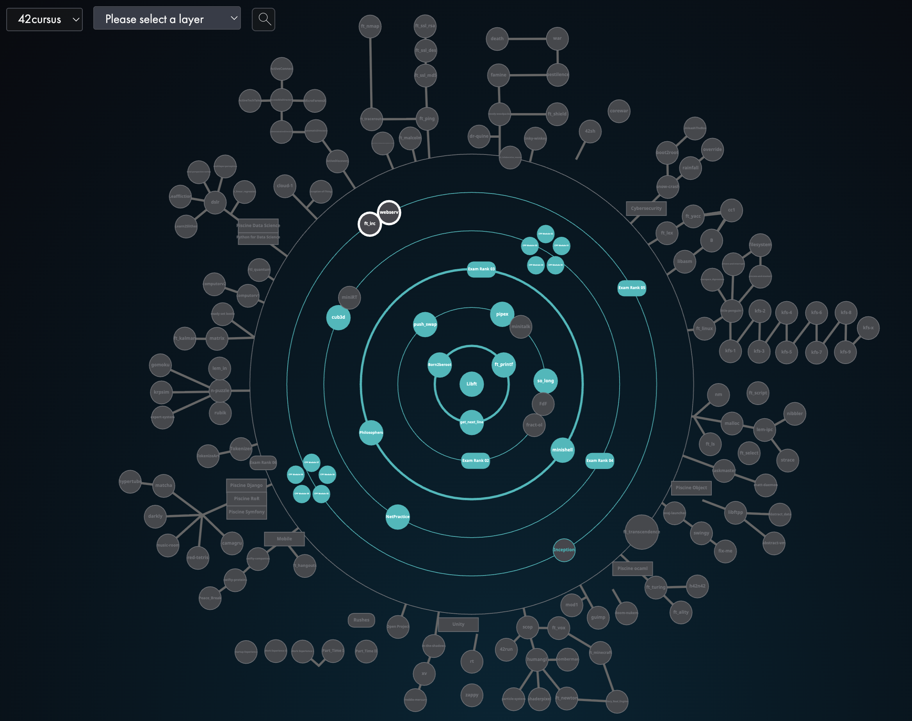

## 42 Madrid Common Core

Collection of projects completed during the 42 Madrid curriculum, focused on systems programming, algorithms, networking, graphics, virtualization and fullstack development.

### Projects
| **Project**                                        | **Description** | **Score**   | **Language** |
| -------------------------------------------------- | --------------- | ----------- | ------------ |
| [libft](https://github.com/Igbescobar/libft)                               | Library of C functions                                   | **100/100**     |                      |
| [ft_printf](https://github.com/Igbescobar/printf)                          | Custom implementation of printf in C       | **100/100**     |                      |
| [get_next_line](https://github.com/Igbescobar/get_next_line)               | Function to read the next line of a file descriptor      | **100/100**     |                      |
| [Born2beroot](https://github.com/Igbescobar/BornToBeRoot)                   | Creation of a Virtual Machine in VirtualBox              | **100/100**     |                      |
| [Push_Swap](https://github.com/Igbescobar/push_swap)                       | Program to sort numbers with a sorting algorithm         | **100/100**     |                      |
| [Pipex](https://github.com/Igbescobar/pipex)                               | Program to execute two commands linking them with a pipe | **100/100**     |                      |
| [So_Long](https://github.com/Igbescobar/so_long)                           | Interative 2D Game                                      | **100/100**     |                      |
| [Exam Rank 02](/lvl2/exam_rank_02)                 | C functions exam                                         | **100/100**     |                      |
| [Philosophers](https://github.com/Igbescobar/Philosophers)                 | Simulation using threads                                 | **100/100**     |                      |
| [Minishell](https://github.com/Igbescobar/minishell) | UNIX-like shell in C                                  | **100/125**     |                      |
| [Exam Rank 03](/lvl3/exam_rank_03)                 | Reduced printf exam                                      | **100/100**     |                      |
| [CPP Module (00 to 04)](/lvl4/CPP_Module)          | C++ Programs                                             | **500/500**     |    |
| [NetPractice](https://github.com/Igbescobar/NetPractice)                   | Networking Connection Simulation                         | **100/100**     |            |
| [Cub3D](https://github.com/Igbescobar/Cub3D)         | Wolfenstein Like 3D Game                                  | **106/125**     |                      |
| [Exam Rank 04](/lvl4/exam_rank_04)                 | Mini bash exam                                           | **100/100**     |                      |
| [CPP Module (05 to 09)](/lvl5/CPP_Module)          | C++ Programs                                             | **500/500**     |    |
| [Exam Rank 05](/lvl5/exam_rank_05)                 | C++ exam                                                 | **100/100**     |                      |

# | [Inception](https://github.com/Igbescobar/Inception) | Virtualized infrastructure using Docker Compose  | **100/100**     |  |
# | [webserv](https://github.com/Igbescobar/Webserv)     | HTTP server implementation in C++                               | **100/100**     |  |
# | [ft_transcendence](https://github.com/BishopVK/ft_transcendence) | Multiplayer fullstack web application with authentication, real-time gameplay and Dockerized deployment         | **125/100**     |                       |
# | [42_Collaborative_resume](/lvl6/42_Collaborative_resume) | Collaborative project focused on mutual interviews and professional resume creation  | **100/100**     |  |
# | [Exam Rank 06](/lvl6/exam_rank_06)                 | Basic non-blocking chat server using select and socket programming in C | **100/100**     |  |
